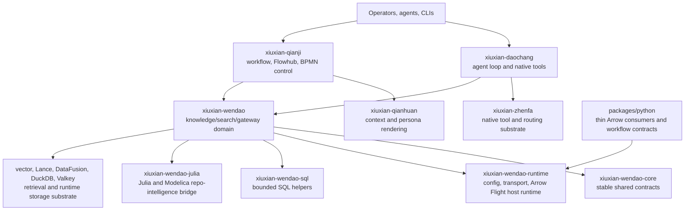

# xiuxian-artisan-workshop

`xiuxian-artisan-workshop` is a Rust-first monorepo for native agent
infrastructure. It brings together knowledge and retrieval (`Wendao`),
workflow and control-plane execution (`Qianji`), context and persona rendering
(`Qianhuan`), agent-loop runtime (`Daochang`), memory, vector/search, storage,
and thin Python consumer packages.

This README is the repository entry map. Detailed contracts live in package
READMEs, RFCs, and the documentation index.

## Current Architecture



The current repository is not organized around the old "Trinity" narrative.
The practical boundary is package ownership:

- **Rust is the source of truth** for execution, routing, retrieval, indexing,
  transport, server/runtime configuration, and persistent contracts.
- **Python is a utility and consumer layer** for Arrow Flight access, workflow
  payload contracts, adapter tests, and analysis helpers. It is not a second
  runtime kernel.
- **Wendao is split into contract, runtime, and domain packages** so shared DTOs
  do not accumulate host behavior or deployment-specific concerns.
- **Daochang reaches Wendao through gateway/native-tool contracts** rather than
  embedding Wendao business logic in-process.
- **Julia and Modelica repo-intelligence integration is owned by
  `xiuxian-wendao-julia`**, with Rust gateway code consuming the managed
  service boundary.

## Primary Package Groups

| Area                            | Package surfaces                                                                                                                                                                                                                                                                                                                                                                                                                                                             | Responsibility                                                                                                                                      |
| ------------------------------- | ---------------------------------------------------------------------------------------------------------------------------------------------------------------------------------------------------------------------------------------------------------------------------------------------------------------------------------------------------------------------------------------------------------------------------------------------------------------------------- | --------------------------------------------------------------------------------------------------------------------------------------------------- |
| Knowledge and retrieval         | [`xiuxian-wendao`](packages/rust/crates/xiuxian-wendao/README.md), [`xiuxian-wendao-core`](packages/rust/crates/xiuxian-wendao-core/README.md), [`xiuxian-wendao-runtime`](packages/rust/crates/xiuxian-wendao-runtime/README.md), [`xiuxian-wendao-sql`](packages/rust/crates/xiuxian-wendao-sql/README.md), [`xiuxian-wendao-julia`](packages/rust/crates/xiuxian-wendao-julia/README.md), [`xiuxian-wendao-client`](packages/rust/crates/xiuxian-wendao-client/README.md) | Wendao domain logic, stable shared contracts, host/runtime behavior, bounded SQL helpers, Julia/Modelica repo intelligence, and local CLI surfaces. |
| Workflow and orchestration      | [`xiuxian-qianji`](packages/rust/crates/xiuxian-qianji/README.md), [`qianji-bpmn-engine`](packages/rust/crates/qianji-bpmn-engine/README.md), [`xiuxian-qianhuan`](packages/rust/crates/xiuxian-qianhuan/README.md)                                                                                                                                                                                                                                                          | Flowhub and BPMN control, workflow validation, persona/context rendering, and execution-facing contract assembly.                                   |
| Agent and tool runtime          | [`xiuxian-daochang`](packages/rust/crates/xiuxian-daochang/README.md), `xiuxian-zhenfa`, `xiuxian-llm`, `xiuxian-security`, `xiuxian-sandbox`                                                                                                                                                                                                                                                                                                                                | Agent loop, native tool routing, LLM orchestration, execution plumbing, and sandbox/security surfaces.                                              |
| Data and memory substrate       | [`xiuxian-vector`](packages/rust/crates/xiuxian-vector/README.md), [`xiuxian-lance`](packages/rust/crates/xiuxian-lance/README.md), `xiuxian-db-store`, [`xiuxian-memory-engine`](packages/rust/crates/xiuxian-memory-engine/README.md), `xiuxian-memory`                                                                                                                                                                                                                    | Vector retrieval, Lance-backed search, database storage helpers, episodic memory, and memory-facing runtime contracts.                              |
| Repository and parser substrate | [`xiuxian-git-repo`](packages/rust/crates/xiuxian-git-repo/README.md), `xiuxian-wendao-parsers`, [`xiuxian-ast`](packages/rust/crates/xiuxian-ast/README.md)                                                                                                                                                                                                                                                                                                                 | Git/repository access, parser ownership, AST tooling, and syntax-aware project-policy gates.                                                        |
| Python adapters                 | [`packages/python`](packages/python/README.md)                                                                                                                                                                                                                                                                                                                                                                                                                               | Thin Arrow, workflow-contract, analyzer, and compatibility packages around Rust-owned contracts.                                                    |

The root [`Cargo.toml`](Cargo.toml) is the canonical Rust workspace manifest.
The package-level READMEs describe package ownership more precisely than this
entry map.

## Where To Start

- [`docs/index.md`](docs/index.md): top-level documentation index.
- [`docs/rfcs/`](docs/rfcs/): durable architecture and governance decisions.
- [`packages/rust/README.md`](packages/rust/README.md): Rust workspace index.
- [`packages/python/README.md`](packages/python/README.md): Python package
  boundary and adapter policy.
- [`packages/rust/crates/xiuxian-wendao/docs/06_roadmap/417_wendao_package_boundary_matrix.md`](packages/rust/crates/xiuxian-wendao/docs/06_roadmap/417_wendao_package_boundary_matrix.md):
  Wendao package-boundary matrix.
- [`docs/testing/README.md`](docs/testing/README.md): test and validation
  documentation.
- [`AGENTS.md`](AGENTS.md): repository engineering protocol for agents and
  automated contributors.

## Development

Use the project environment for repository-scoped commands:

```bash
direnv allow
direnv exec . scripts/rust/cargo_exec.sh fmt --all --check
direnv exec . scripts/rust/cargo_exec.sh nextest run --workspace --exclude xiuxian-core-rs --no-fail-fast
direnv exec . bash scripts/rust/test_xiuxian_core_rs.sh --lib --no-fail-fast
```

Common focused checks:

```bash
direnv exec . scripts/rust/cargo_exec.sh nextest run -p xiuxian-wendao --lib
direnv exec . scripts/rust/cargo_exec.sh clippy -p xiuxian-wendao-runtime --tests --features transport -- -D warnings
direnv exec . uv run pytest
```

The GitHub Actions baseline follows the same shape: Rust formatting, workspace
clippy with warnings denied, process-managed Wendao service probes, workspace
`cargo nextest`, and the PyO3 bridge library test lane.

## Documentation Rules

Canonical repository docs should describe stable package, RFC, and README
surfaces. Do not link canonical docs to transient runtime, cache, or local data
directories. Use package README files and RFCs for durable architecture
contracts; use local tracking files only for active execution state.

When package boundaries change, update this README only as the entry map. The
owning package README or RFC should hold the detailed contract.
